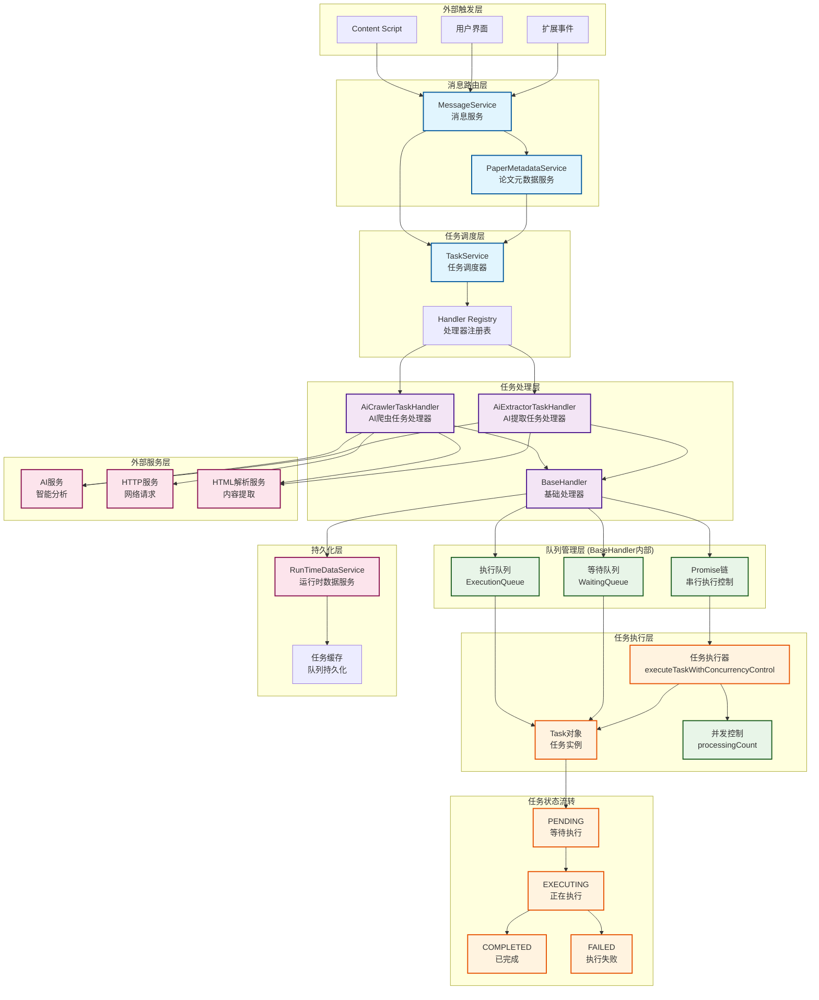
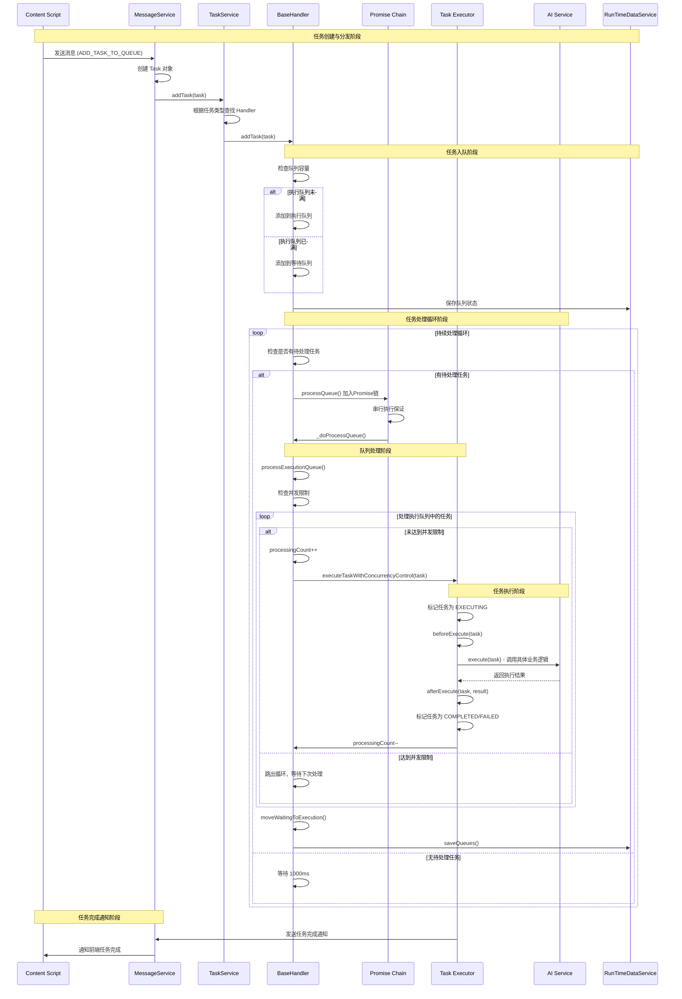

# Service层服务文档

## 任务处理模型架构

### 系统整体架构图



### 任务执行流程图



### 架构特性

- **分层设计**：清晰的分层架构，职责分离
- **并发控制**：Promise链确保队列处理串行执行，避免竞态条件
- **队列管理**：双队列设计（执行队列+等待队列），支持任务缓冲
- **持久化支持**：任务状态可持久化，支持重启恢复
- **可扩展性**：通过BaseHandler抽象类支持不同类型的任务处理器
- **错误处理**：完整的错误处理和状态管理机制

---

## 服务详细说明

### MessageService 消息服务

**功能定位：**
统一处理扩展内部消息的收发和分发，连接content script与background script之间的通信。

**核心功能：**
1. **消息路由**：根据消息action将请求分发到对应的处理器
2. **任务管理**：处理ADD_TASK_TO_QUEUE消息，将任务添加到任务队列
3. **任务通知**：向匹配的标签页发送任务完成通知
4. **配置管理**：处理配置相关的消息请求
5. **论文盒管理**：处理论文的添加、删除操作
6. **论文元数据处理**：处理PROCESS_PAPERS消息，调用paperMetadataService处理论文列表

**核心方法：**
- `initialize()`: 初始化消息服务和任务服务
- `handleAddTaskToQueue()`: 处理任务添加到队列的请求
- `handleProcessPapers()`: 处理论文列表处理请求，调用paperMetadataService
- `handlePaperPreprocessingCompleted()`: 处理论文预处理完成事件，调用paperMetadataService进行事件处理和缓存
- `sendTaskCompletionNotification()`: 发送任务完成通知给前台页面

**支持的消息类型：**
- `PROCESS_PAPERS`: 接收论文列表并通过paperMetadataService为每个论文创建AI提取任务
- `ADD_TASK_TO_QUEUE`: 将任务添加到任务队列
- `TASK_COMPLETION_NOTIFICATION`: 任务完成通知
- `PAPER_PREPROCESSING_COMPLETED`: 论文预处理完成事件，由AiExtractorTaskHandler广播
- 其他配置和论文盒相关消息

**最近修复：**
- 修复了缺少常量导入导致的"Could not establish connection"错误
- 添加了AI_CRAWLER_SUPPORTED_TASK_TYPES和AI_EXTRACTOR_SUPPORTED_TASK_TYPES常量的导入
- 实现了PROCESS_PAPERS消息处理，支持GoogleScholarAdapter通过paperMetadataService创建论文提取任务
- 实现了PAPER_PREPROCESSING_COMPLETED消息处理，支持AiExtractorTaskHandler通过事件机制通知paperMetadataService论文预处理完成，实现自动缓存更新
- **关键修复**：修复了handleGetPaperBoxData方法永久阻塞问题 - 该方法之前被完全注释掉但仍在handlers中注册，导致GET_PAPER_BOX_DATA消息永远不会调用sendResponse，现已恢复正确实现使用paperBoxManager.getPaperBox()

### TaskService 任务服务

**功能定位：**
提供后台任务的综合执行、管理能力。

**设计细节：**

首先定义基础的任务执行能力。这些能力定义在基础任务类中，可以用于快速创建业务的任务执行器。

1. **任务类的定义**：任务类包含了一个任务执行所需的全部业务参数。包括任务的key、任务类型、任务状态、任务执行时的入参、任务的执行状态、任务的创建时间。承担的任务包括：根据任务类型找到合适的业务Handler，将入参传入业务Handler来执行。创建时间主要是用于删除策略，任务的key用于唯一标志该任务。

2. **任务的状态**：包含等待执行、正在执行、已成功执行、已执行出错四个状态。

3. **任务队列**：包含执行队列和等待队列，新任务直接进入执行队列，但是如果执行队列满，进入等待队列。两个队列的大小可以在创建执行器时配置。

4. **持久化机制**：分业务持久化不同的队列，并可以在重启时恢复。恢复时保证完全还原任务的处理状态。为保证执行队列和等待队列的数据在持久化前后一致，需要及时更新它们的持久化信息。每种状态的任务有不同的策略可选，如不持久化、保存固定天数、保存固定条数。

然后，根据这个基础类，可以创建一系列handler。这些handler可以注册在taskService类中。当外界传入Task对象时，可以根据任务类型，调用不同的Handler。

### httpService

**功能：** 提供HTTP相关服务, 如获取指定url的html文本。

**方法：**
- `getHtml(url)`: 异步方法，根据传入的 URL，返回网页的 HTML 文本。

### htmlParserService

**功能：** 提供HTML解析服务，通过offscreen document安全地解析HTML并提取内容。

**最新优化：**
- 重构了offscreen.js，删除重复代码，改为导入util/htmlParser.js中的通用函数
- 优化了extractLargeTextBlocks方法，在判断长度前删除所有空白字符，但返回保留格式的文本块
- 遵循DRY原则，避免在多个文件中维护相同的HTML解析逻辑

详情见[htmlParserService.md](./htmlParserService.md)

---

## BaseHandler 并发控制优化

### 问题描述

原有的 `processQueue()` 方法使用简单的布尔标志位 `isProcessing` 来防止并发执行，但存在竞态条件问题：

```javascript
// 原有实现的问题
if (this.isProcessing) {  // 时刻1：线程A检查，发现为false
  return;
}
// 时刻2：线程B也检查，也发现为false（因为A还没设置为true）
this.isProcessing = true; // 时刻3：A设置为true
// 时刻4：B也设置为true，两个都进入了执行区域
```

这种情况下，多个异步调用可能同时绕过检查，导致队列处理的并发执行，破坏数据一致性。

### 解决方案

采用 **Promise 链串行化** 的方式来确保 `processQueue()` 方法的串行执行：

```javascript
// 构造函数中初始化Promise链
this.processingChain = Promise.resolve();

// processQueue方法的新实现
async processQueue() {
  // 将新的处理任务添加到Promise链的末尾
  this.processingChain = this.processingChain
    .then(() => this._doProcessQueue())
    .catch(error => {
      logger.error(`[${this.handlerName}] 队列处理失败:`, error);
      // 即使出错也要继续处理后续任务，不要中断整个链
    });

  // 返回当前的处理Promise，调用者可以选择等待或不等待
  return this.processingChain;
}
```

### 方案优势

1. **无竞态条件**：利用 JavaScript 事件循环的特性，对 `this.processingChain` 的赋值操作是原子的
2. **自然队列化**：多个并发调用会自动排队，按顺序执行
3. **错误隔离**：单次处理失败不会中断整个处理链
4. **代码简洁**：相比复杂的锁机制，Promise 链更符合 JavaScript 异步编程模式

### 技术原理

- **Promise 链的不可变性**：每次 `.then()` 都会创建新的 Promise，不会修改原有 Promise
- **事件循环保证**：JavaScript 单线程特性确保赋值操作的原子性
- **串行执行**：后续调用必须等待前面的 Promise 完成才能执行

这个解决方案在 JavaScript 异步环境中完全可靠，有效避免了并发控制的竞态条件问题。
