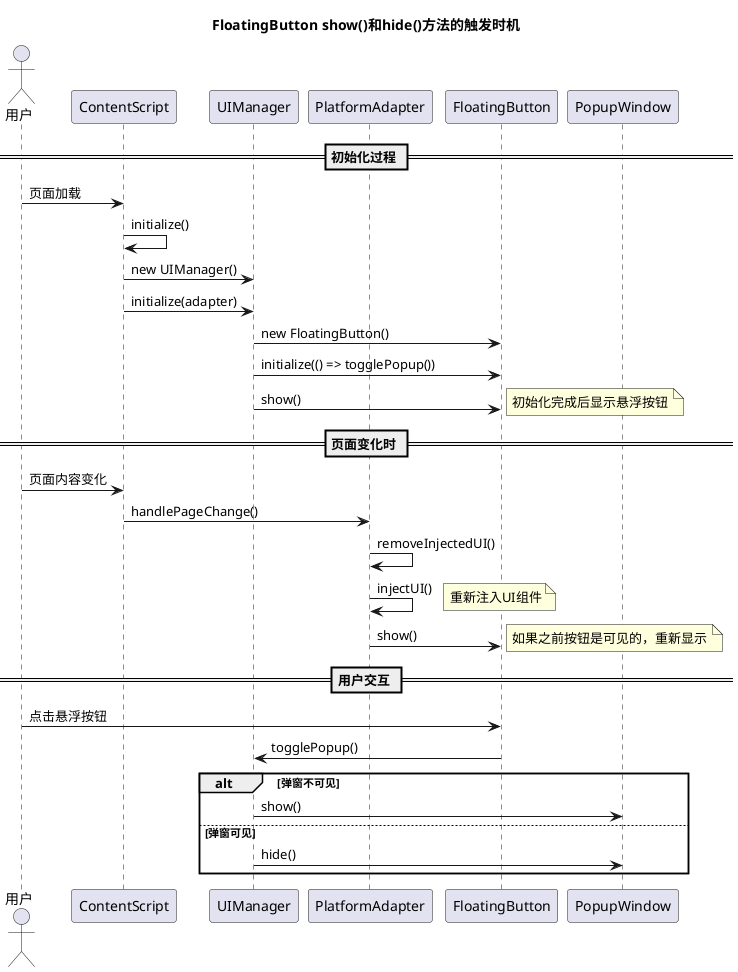
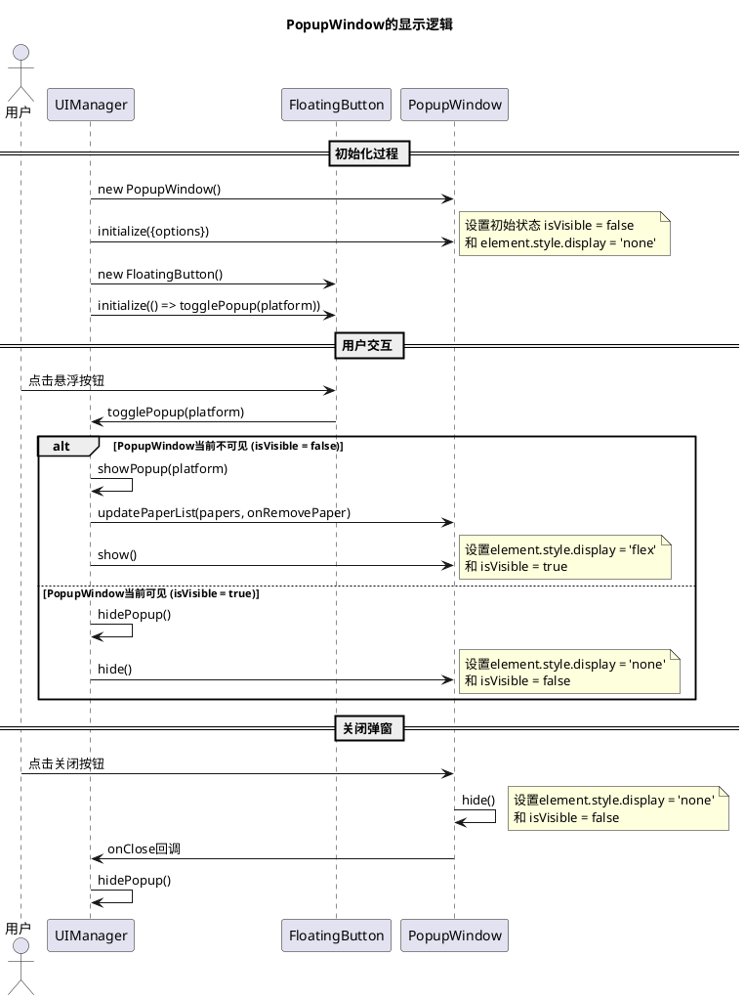

# 核心流程
1、悬浮按钮的显示

```plantuml
@startuml
title FloatingButton show()和hide()方法的触发时机

actor 用户
participant "ContentScript" as CS
participant "UIManager" as UI
participant "PlatformAdapter" as PA
participant "FloatingButton" as FB
participant "PopupWindow" as PW

== 初始化过程 ==
用户 -> CS: 页面加载
CS -> CS: initialize()
CS -> UI: new UIManager()
CS -> UI: initialize(adapter)
UI -> FB: new FloatingButton()
UI -> FB: initialize(() => togglePopup())
UI -> FB: show()
note right: 初始化完成后显示悬浮按钮

== 页面变化时 ==
用户 -> CS: 页面内容变化
CS -> PA: handlePageChange()
PA -> PA: removeInjectedUI()
PA -> PA: injectUI()
note right: 重新注入UI组件
PA -> FB: show()
note right: 如果之前按钮是可见的，重新显示

== 用户交互 ==
用户 -> FB: 点击悬浮按钮
FB -> UI: togglePopup()
alt 弹窗不可见
    UI -> PW: show()
else 弹窗可见
    UI -> PW: hide()
end

@enduml
```

### 2、弹窗的显示

```plantuml
@startuml
title PopupWindow的显示逻辑

actor 用户
participant "UIManager" as UI
participant "FloatingButton" as FB
participant "PopupWindow" as PW

== 初始化过程 ==
UI -> PW: new PopupWindow()
UI -> PW: initialize({options})
note right: 设置初始状态 isVisible = false\n和 element.style.display = 'none'
UI -> FB: new FloatingButton()
UI -> FB: initialize(() => togglePopup(platform))

== 用户交互 ==
用户 -> FB: 点击悬浮按钮
FB -> UI: togglePopup(platform)
alt PopupWindow当前不可见 (isVisible = false)
    UI -> UI: showPopup(platform)
    UI -> PW: updatePaperList(papers, onRemovePaper)
    UI -> PW: show()
    note right: 设置element.style.display = 'flex'\n和 isVisible = true
else PopupWindow当前可见 (isVisible = true)
    UI -> UI: hidePopup()
    UI -> PW: hide()
    note right: 设置element.style.display = 'none'\n和 isVisible = false
end

== 关闭弹窗 ==
用户 -> PW: 点击关闭按钮
PW -> PW: hide()
note right: 设置element.style.display = 'none'\n和 isVisible = false
PW -> UI: onClose回调
UI -> UI: hidePopup()

@enduml
```