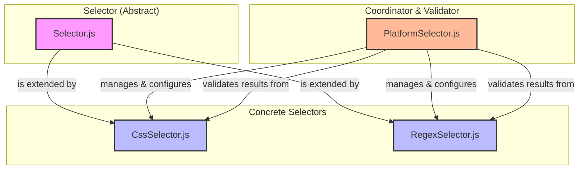

# Model 模块

`Model` 模块定义了 LitHelper 应用程序的核心数据结构。这些模型封装了与插件功能相关的数据和业务逻辑，例如论文、任务、结果和选择器配置。

## 主要数据模型

### `Paper.js`

`Paper` 模型代表一篇学术论文的核心元数据。

- **主要职责**: 存储论文的标题、作者、摘要、URL、发表日期等信息。
- **关联模块**:
  - `paperMetadataService`: 用于获取和填充 `Paper` 对象。
  - `summarizationHandler`: 对 `Paper` 对象的摘要进行处理。

### `Task.js`

`Task` 模型定义了需要在后台执行的任务，例如 AI 摘要、数据抓取等。

- **主要职责**: 封装任务的类型、状态、数据和元数据。
- **关联模块**:
  - `taskService`: 创建和管理 `Task` 对象的生命周期。
  - `aiCrawlerTaskHandler`: 处理特定类型的 `Task`。

### `Result.js`

`Result` 模型用于封装操作的成功或失败状态，并携带相应的数据或错误信息。

- **主要职责**: 提供一个标准化的方式来返回函数或服务的执行结果。

### `Summary.js`

`Summary` 模型存储了由 AI 服务生成的摘要内容。

- **主要职责**: 封装摘要文本、使用的模型、token 数量等元数据。

---

## 选择器 (Selector) 架构

选择器架构是 LitHelper 实现对不同网站内容进行精准提取的核心。它通过一个分层的、可配置的模型，将**数据提取**与**业务验证**分离开来，实现了高度的灵活性和可扩展性。

### `Selector.js` (抽象基类)

`Selector.js` 是所有选择器的抽象基类，定义了所有选择器共有的接口和属性。

- **主要职责**:
  - 提供通用属性，如 `domain`, `pageType`, `description`, 和 `validation`。
  - 定义了 `extract()` 和 `clone()` 等必须由子类实现的抽象方法。
- **设计思想**: 通过基类统一接口，实现了对不同类型选择器（如 CSS 和 正则表达式）的统一管理。

### `CssSelector.js` (具体实现)

`CssSelector` 继承自 `Selector`，专门用于通过 **CSS 选择器**从 DOM 中提取数据。

- **主要职责**: 实现 `extract(element)` 方法，接收一个 DOM 元素，并使用 `querySelectorAll` 提取其文本内容。
- **使用场景**: 当目标数据在页面的 HTML 结构中具有明确且唯一的 CSS 路径时使用。

### `RegexSelector.js` (具体实现)

`RegexSelector` 继承自 `Selector`，专门用于通过**正则表达式**从字符串中提取数据。

- **主要职责**: 实现 `extract(text)` 方法，接收一段文本内容，并使用正则表达式进行匹配和提取。
- **使用场景**: 当目标数据没有固定的 HTML 结构，但其文本内容满足特定模式时使用（例如，从一段连续的文本中提取 PDF 链接）。

### `PlatformSelector.js` (核心协调器)

`PlatformSelector` 是选择器架构的核心协调者，它将具体的 `Selector` 子类组合起来，并负责执行**业务验证逻辑**。

- **核心属性**（仅包含三个属性）:
  - `domain`: 网站一级域名（如：scholar.google.com）
  - `pageType`: 网页类型（search_results 或 paper_detail）
  - `extractors`: 提取器配置对象，包含多个具体的提取器实例

- **主要职责**:
  - **管理提取器**: 为不同的提取目标（如 `TITLE`, `PDF`, `ABSTRACT`）配置相应的 `CssSelector` 或 `RegexSelector`。
  - **集中验证**: 包含一套预定义的业务验证规则（`PREDEFINED_VALIDATIONS`），并提供了 `validateResults()` 和 `validateWithPredefined()` 方法来验证由 `Selector` 提取出的结果。
  - **解耦**: 将"如何提取数据"（`Selector` 的职责）与"提取出的数据是否符合业务要求"（`PlatformSelector` 的职责）分离开来。

- **关键方法**:
  - `setExtractorMode`: 该方法用于设置或更新提取器。如果提取器不存在，则会创建一个新的提取器实例，实现了动态配置的能力。

### 架构图

这个分层架构使得 LitHelper 能够轻松适配新的网站或新的数据提取需求。如果将来需要支持 XPath 选择器，只需创建一个新的 `XPathSelector` 类继承自 `Selector`，`PlatformSelector` 几乎无需改动即可集成新的选择器。 